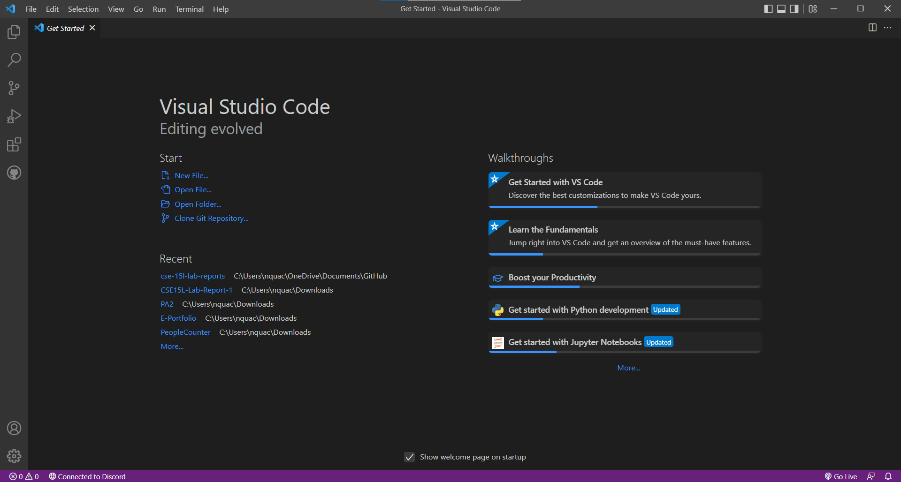
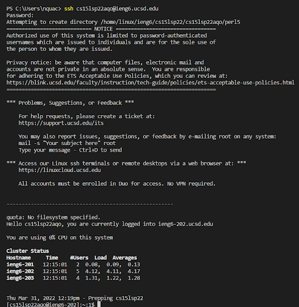
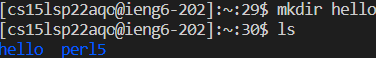
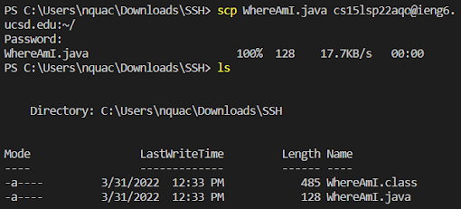
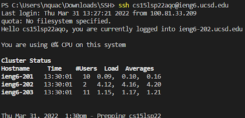
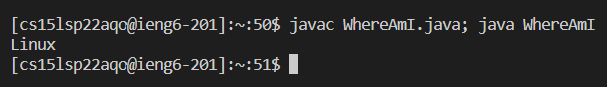
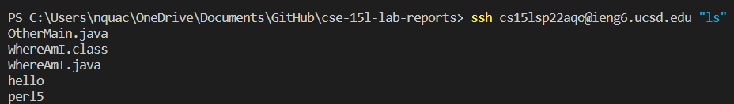

<a>

# Remote Access

## Installing Visual Studio Code

  

To install Visual Studio Code, we need to visit the website, https://code.visualstudio.com/. Then, follow the instructions to download and install it on your computer. Make sure to download the right version!
 
 

## Remotely Connecting

  

The first step to connecting to a remote host on Windows is installing [OpenSSH](https://docs.microsoft.com/en-us/windows-server/administration/openssh/openssh_install_firstuse). If on Mac, this step is not needed. Next, open a terminal in VSCode and type in the command below, but replace ***cs15lsp22aqo*** with your own username.

`>> $ ssh cs15lsp22aqo@ieng6.ucsd.edu`

You will get a message that says:

`Are you sure you want to continue connecting (yes/no/[fingerprint])?`

Say yes and then enter your password. You now have successfully remotely connected to a remote host!
 
 

## Trying Some Commands

  

Next type in some commands in your terminal. Two examples are given about. Here are some commands you can try:

`>> cd ~`  
`>> cd`  
`>> ls -lat`  
`>> touch filename.txt`  
`>> cat > filename.txt`  
 
 

## Moving Files with `scp`

  

In order to move files with `scp`, type the following command in the terminal with your own file name and remote host login:

`>> scp <file_name> cs15lsp22aqo@ieng6.ucsd.edu:~/`

You will then be prompted for your password. If you log into ieng6 with ssh again, you should see the file there when you type in `ls` into the terminal. You can use the image above as reference.
 
 

## Setting an SSH Key

  

Setting an SSH key allows you to log into the remote host with having to enter your password everytime. Above is what it is supposed to look like when you login with the key. On your computer enter these commands:

`>> $ ssh-keygen`  
`>> Generating public/private rsa key pair.`  
`>> Enter file in which to save the key (/Users/<User_Name>/.ssh/id_rsa): /Users/<User_Name>/.ssh/id_rsa`  
`>> Enter passphrase (empty for no passphrase):`  
 
**Leave the passphrase empty**  
 
If on Windows, follow the extra steps [here](https://docs.microsoft.com/en-us/windows-server/administration/openssh/openssh_keymanagement#user-key-generation).

Now you need to copy the *public* key to your remote host with the follow commands:
 

`>> $ ssh cs15lsp22aqo@ieng6.ucsd.edu`  
`>> $ mkdir .ssh`  
`$ exit`  
`$ scp /Users/<User_Name>/.ssh/id_rsa.pub cs15lsp22aqo@ieng6.ucsd.edu:~/.ssh/authorized_keys`  
 

Now you should be able to login to your remote host without having to input your password!
 
 

## Optimizing Remote Running

  
In the command above, I used **`;`** to combine two separate commands into one line. This compiled the *WhereAmI.java* file and ran it, using one line. You can try it one your own:

`>> $ javac WhereAmI.java; java WhereAmI`

  

Above I was able to log into a remote server and use a command **inside** it using one line of code with this command below. Try it yourself!

`>> $ ssh cs15lsp22aqo@ieng6.ucsd.edu "ls"`

You can also use the up-arrow on your keyboard to call the last command you ran. Using these tricks will help you optimize your remote running time!