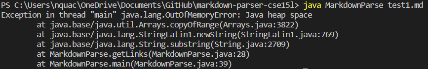
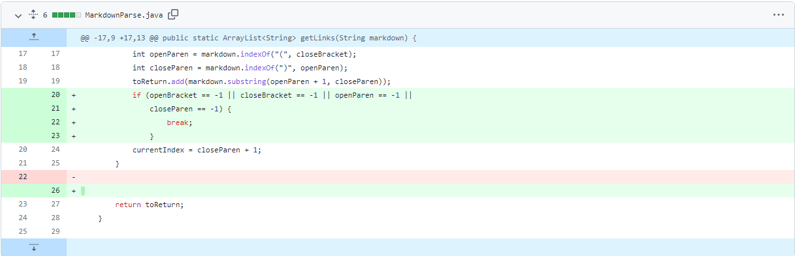
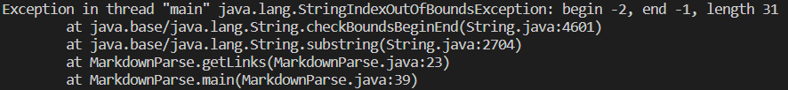
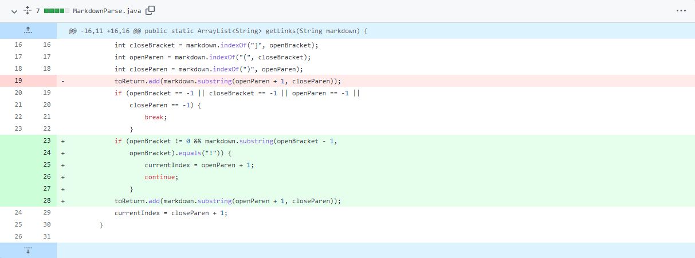
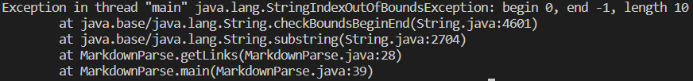
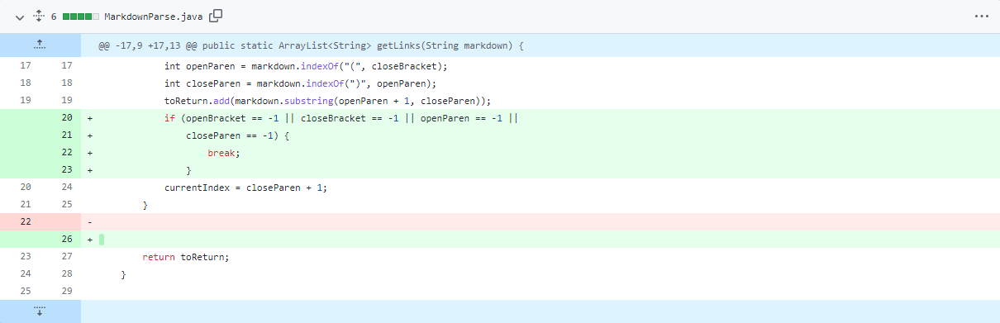

<a>

# Lab Report 2 - Incremental Development

## Bug #1

#### Bug #1 Symptom

  

#### Bug #1 Fix

  

*[failure-inducing input 1](https://github.com/nquach1515/markdown-parser-cse15l/blob/main/test1.md)*

The bug was that the index wasn't updating because there was an empty line after 
the last link. This made the while loop infinite. Eventually, we run out of memory 
and the code crashed. To fix this, I checked if the current index was -1 to break 
the loop. 
 
 

## Bug #2

#### Bug #2 Symptom

  

#### Bug #2 Fix

  

*[failure-inducing input 2](https://github.com/nquach1515/markdown-parser-cse15l/blob/main/test2.md)*

The bug was that the parser was still parsing and returning the links / file locations 
of images. We don't want this, so to fix it, I checked if the character before an 
open bracket was an "!". If it was, I skipped that whole image, and continued to 
the next loop.
 
 

## Bug #3

#### Bug #3 Symptom

  

#### Bug #3 Fix

  

*[failure-inducing input 3](https://github.com/nquach1515/markdown-parser-cse15l/blob/main/test3.md)*

The bug was that the parser would return index out of bounds errors for blank files 
with no links or text. To fix this, I checked to see if the current index at the end 
of the loop was -1, because this is what it would be if nothing was in the file. If 
the current index was -1, I would break the loop and code would end and return a 
blank array [].