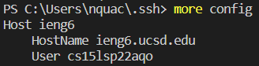

<a>

# Lab Report 3 - Lab Group Choices

## Streamlining ssh Configuration

This is my .ssh/config file and I edited it using VSCode.

To log into my server, I only have to type `ssh ieng6` in to log in. This is a lot
faster than what we previously had to do, which was type in our whole username
and password.

The screenshot above shows that I copied a file from my local to my server using
`ieng6` as the username.
 
 

## Setup Github Access from ieng6

This screenshot above shows my public ssh key on Github connected to my account.

This screenshot shows where my key files are stored on my remote server.

Here, I used `git` commands to add, commit, and push an update to my Github repository.  
This is the link for the [new commit](https://github.com/nquach1515/cse15l-git-ssh-key/commit/0887b6281bc2c159eef53c81adf524e77df546f8).
 
 

## Copy whole directories with `scp -r`

This screenshot above shows how to copied the whole directory of MarkdownParse to `ieng6` by using
`scp -r . ieng6:~/markdown-parse`

This screenshot above shows me logging into my ieng6 and testing the MarkdownParse code.

This screenshot above shows how I was able to copy the whole directory of MarkdownParse to `ieng6`
and was able to test the code in one line. There was an error with JUnit, but that 
is something that we can fix outside of the lab report.