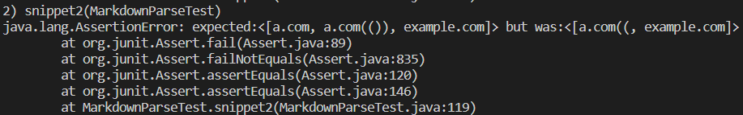
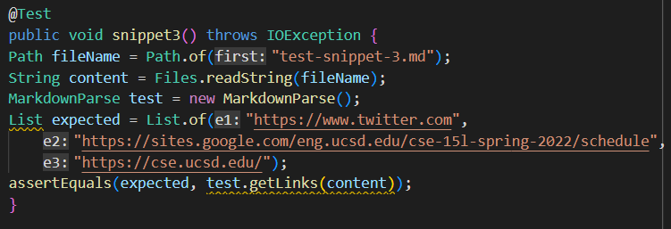

<a>

# Lab Report 4 - Testing MarkdownParse Some More

[My Respository](https://github.com/nquach1515/markdown-parser-cse15l)
 

[Repository I Reviewed](https://github.com/Combobyte/markdown-parser)

## Snippet 1

What *should* Snippet 1 produce?  
``[`google.com]``

### MarkdownParseTest for Snippet 1

### Test on My MarkdownParse

### Test on My Peer's MarkdownParse

I don't think there would be a small code change that would be able to make 
either mine, or my peer's code to be able to detect the correct links for
Snippet 1. I think it would take more than 10 lines because we would have to check 
for backticks, and then check again if there is an open and closed parenthesis. Then, 
we would have to check if there is another backtick to find if it closes.

## Snippet 2

What *should* Snippet 2 produce?  
``[a.com, a.com(()), example.com]``

### MarkdownParseTest for Snippet 2

### Test on My MarkdownParse

### Test on My Peer's MarkdownParse

I don't think there would be a small code change that could make either mine or 
my peer's program work properly to parse Snippet 2. I thought that we could use 
a stack to figure out what is the opening and closes parenthesis and brackets. 
However, we would have to figure out which contents inside which parenthesis are 
links that are valid for markdown, or if they are just dummy parenthesis that are 
put there to test and/or trick the program. Therefore, this would take over 10 
lines.

## Snippet 3

What *should* Snippet 3 produce?  
``[https://www.twitter.com, https://sites.google.com/eng.ucsd.edu/cse-15l-spring-2022/schedule, https://cse.ucsd.edu/]``

### MarkdownParseTest for Snippet 3

### Test on My MarkdownParse

### Test on My Peer's MarkdownParse

I don't think there is a small code change that could make either mine or my peer's 
program work properly to parse Snippet 3. Clearly, both of our programs are producing 
the incorrect output. In order to fix it, we would have to make a method to remove 
the extra blank spaces in between the links. We would also have to check for open 
parenthesis or bracket that shouldn't close, but do have a close because of a later link, 
so this would take over 10 lines.