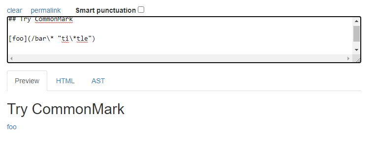
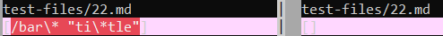
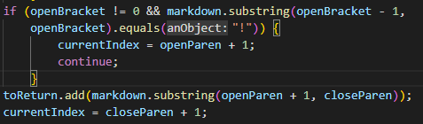
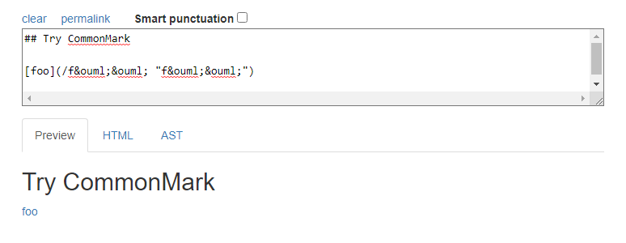
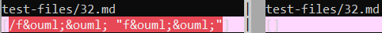

<a>

# Lab Report 5 - Different Bugs

### How did I find different results?
1. I first setup my respository and the repository provided by CSE 15L on `ieng6`.
2. Next, I edited the make files in each repository to print out the file names.
3. After, I used `bash script.sh > results.txt` on each repository.
4. Finally, I used `vimdiff my-markdown-parser/results.txt cse15lsp22-markdown-parser/results.txt`
to compare the two files.

## test-files/22.md
[Link to file 22.md](https://github.com/nidhidhamnani/markdown-parser/blob/main/test-files/22.md)

Commonmark:  

`Expected output: [bar*]`

Left: My MarkdownParse output  
Right: CSE 15L MarkdownParse output

 
How would we fix my MarkdownParse?  

My output for file `22.md` is incorrect. The thing that is wrong with my code is that 
I don't check to see if there are a pair of quotation marks inside the parenthesis. In 
order to fix the output, we would need to add something similar to the code below, 
but with checking quotation marks inside the parenthesis, if it is a link.

## test-files/32.md
[Link to file 32.md](https://github.com/nidhidhamnani/markdown-parser/blob/main/test-files/32.md)

Commonmark:  

`Expected output: [/f&ouml;&ouml;]`

Left: My MarkdownParse output  
Right: CSE 15L MarkdownParse output

 
How would we fix my MarkdownParse?  

My output for file `32.md` is incorrect. My code does not check quotation marks 
inside the link. To fix this we would need to fix the code below, or implement 
something new that checks for quotation marks inside links.

